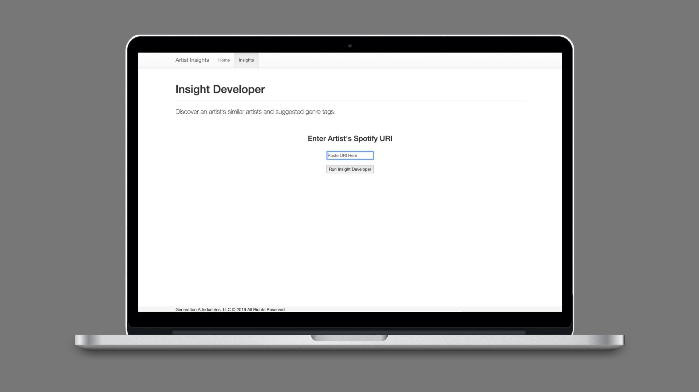
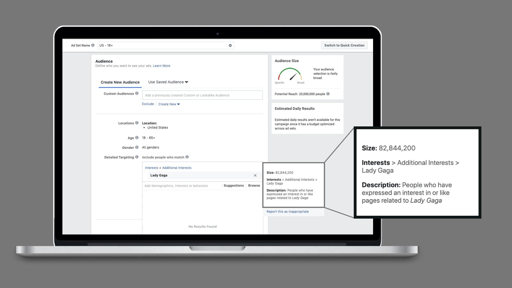
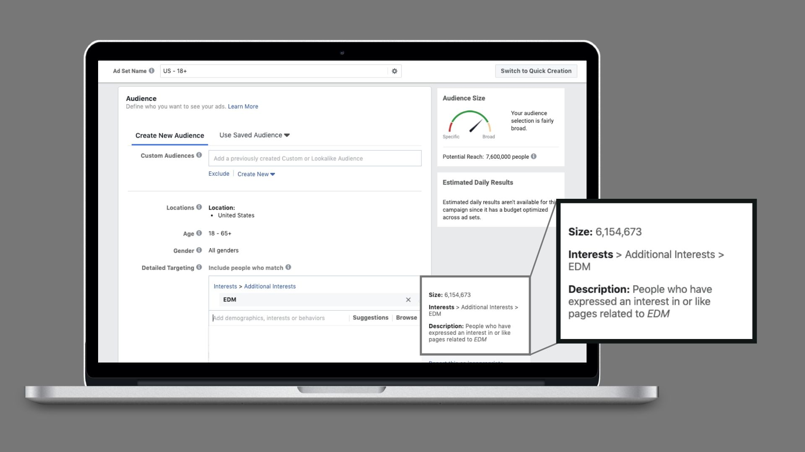
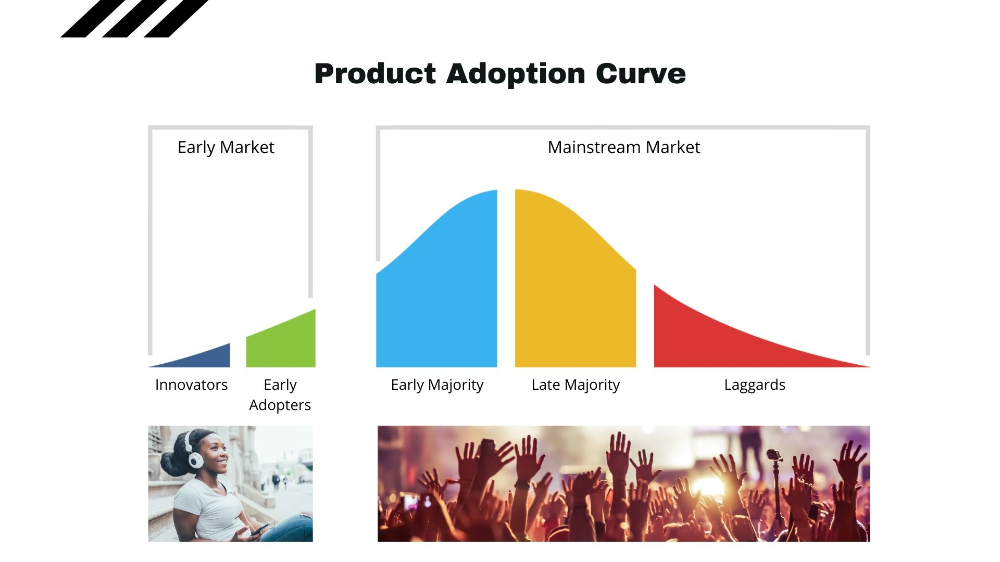
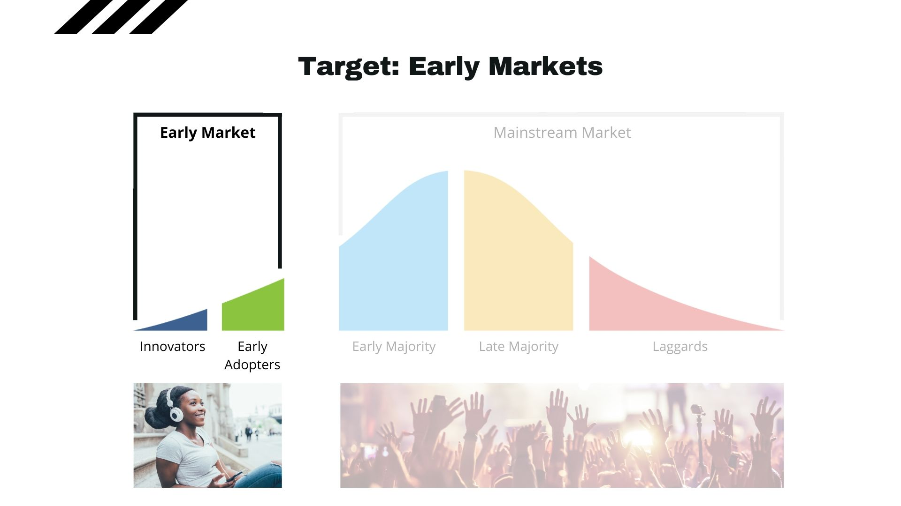
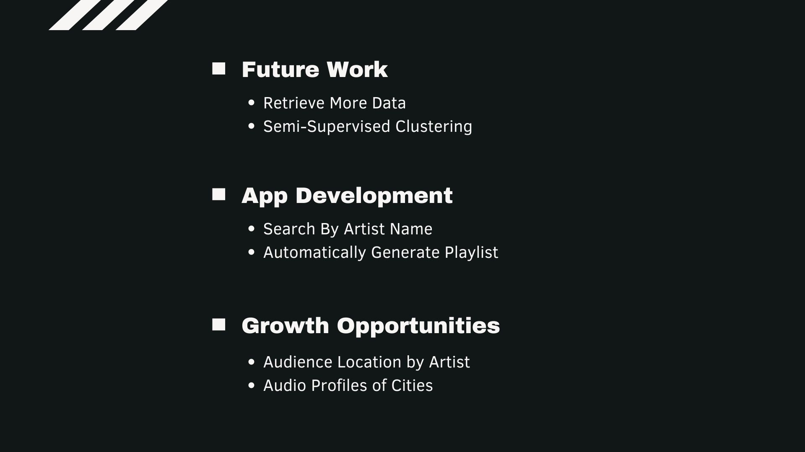

# Insights for Music Artists

## Spotify Data Dashboard

## Artist Insights Web App

## Andrew Marks - DJ, Producer, Dance Music Artist

## Copy Artist Spotify URI

## Artist Insights Report

## So why find similar artists and suggested genre tags?

### Facebook Ads Targeting: Lady Gaga

### Facebook Ads Targeting: EDM

## Why stratify similar artists by popularity score?

### Product Adoption Curve

### Target Early Markets

## Next Steps

