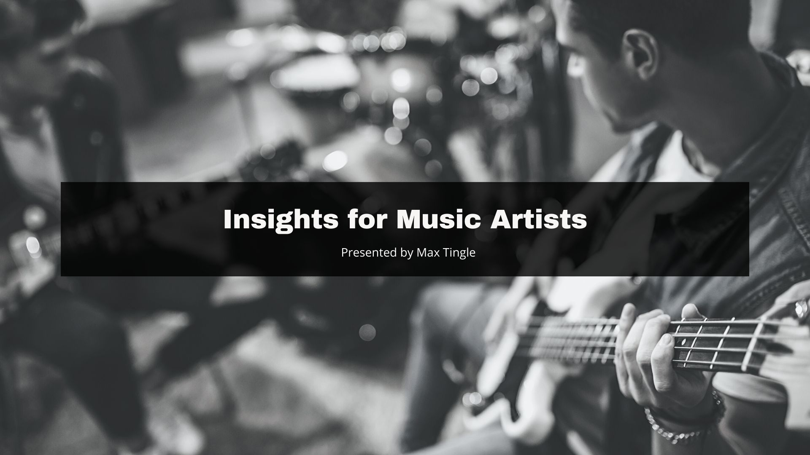
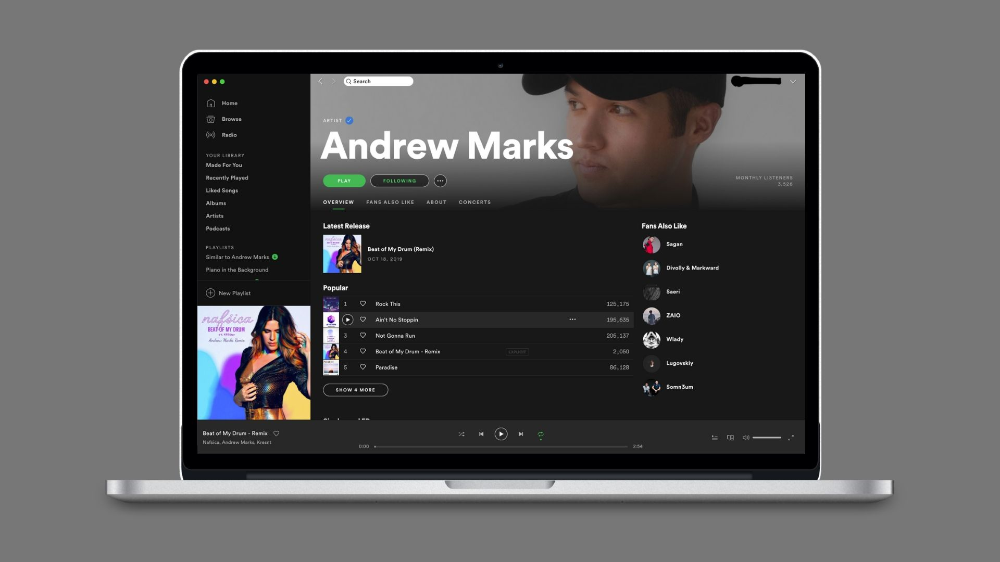
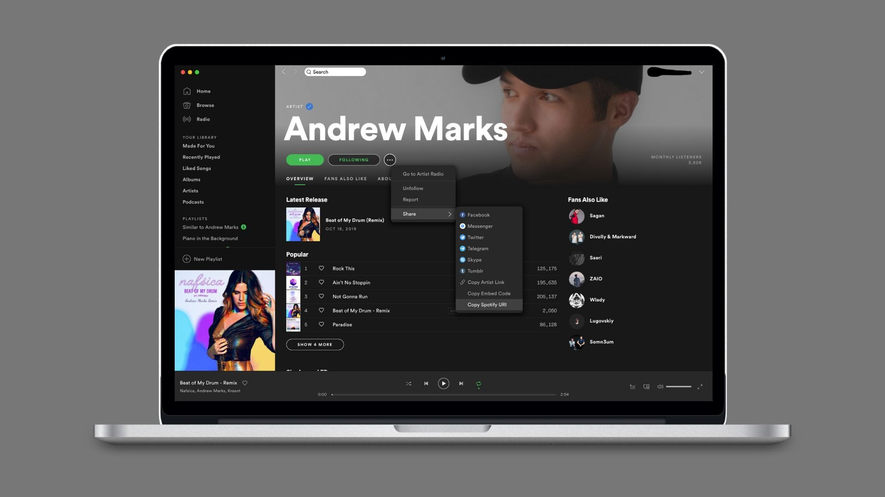
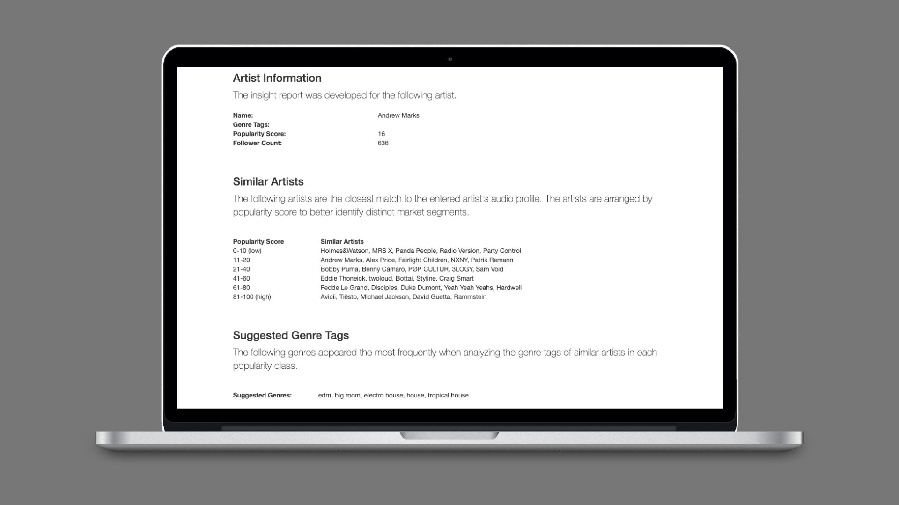
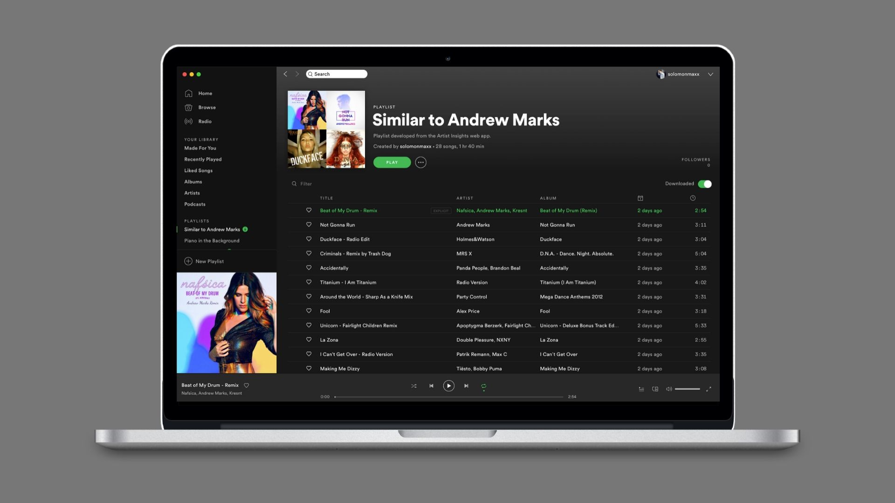
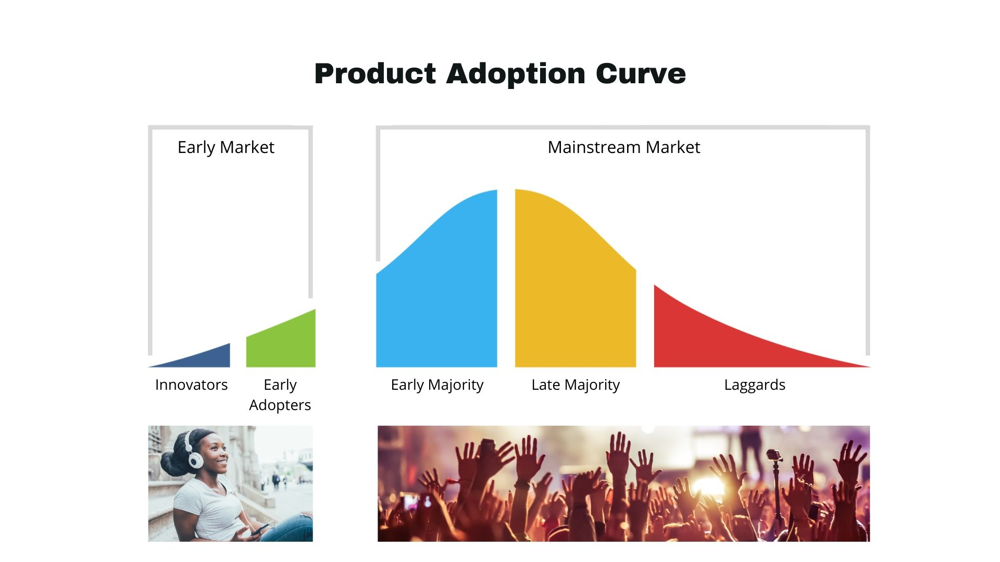
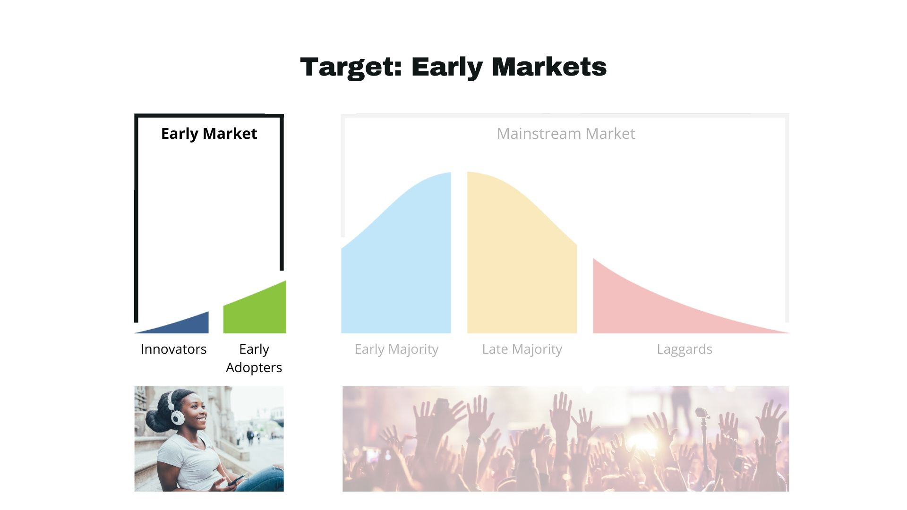
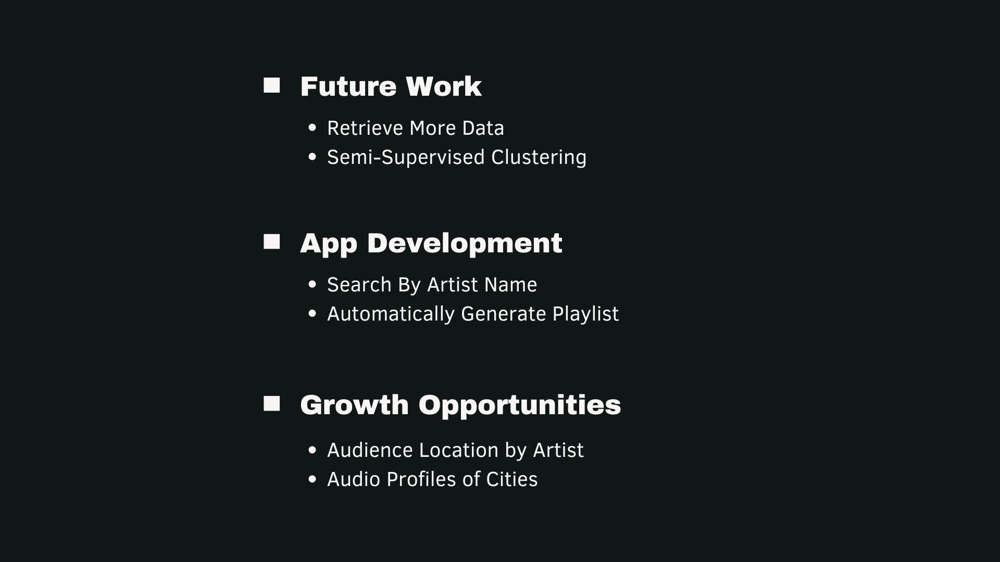

# Insights for Music Artists

I am a graduate of the Flatiron School's Data Science Fellowship program. I completed the Washington, DC-based 15-week intensive data science bootcamp in December of 2019. "Insights for Music Artists" is the fourth in a series of projects where I worked with data retrieved from Spotify's API to practice hypothesis testing, regression and classification analyses, and tuning machine learning algorithms to make predictions. 

For this project, I conducted market segmentation analysis for ~300,000 artists retrieved from Spotify’s Web API using unsupervised learning (clustering and dimensionality reduction) and distance-based clustering. I then developed a Flask web app (deployed via Heroku) that finds artists who share similar audio profiles.

## Problem: New Artists Have No Data

Currently, music artists have access to data-backed insights from companies like Spotify, Apple Music, and YouTube (to name a few). The insights provided are derived from listener engagement data (as pictured in the Spotify dashboard above), listener demographic data, streaming data, as well as earned revenue data. 

The problem, however, is that new artists are highly unlikely to have a substantial listenership, meaning that majority of their songs have been streamed under 1,000 times. Therefore, **new artists do not yet have enough data** to fuel the insights provided by these companies, leaving them with minimal insights to inform their marketing efforts.

## Solution: Artist Insights Web App

I developed a model and subsequent web app that returns useful insights for artists at any point in the development of their listenership, especially for new artists with minimal to no data. The web app does the following:

  1. Returns the name, genre tags, popularity score, and follower count of the entered artist.
  
  2. Finds artists who share similar audio profiles to the entered artist and stratifies the results by popularity score.

  3. Suggests genre tags for the entered artist based on the frequency of the similar artists' genre tags.

[LINK - Artist Insights Web App](.heroku.com)

## App Demonstration: Andrew Marks (DJ, Producer, Dance Music Artist)

For a live demonstration of the Artist Insights web app, open Spotify via the desktop or website and log-in to your account. The following process will not work when using the Spotify mobile app. Once logged in, use the search bar at the top to find "Andrew Marks."

Then, you will need Andrew's Spotify URI to run the Insights Developer. A URI is a unique code that Spotify assigns to each artist, track, album, user, and playlist. To copy Andrew's Spotify URI, click the circle with three dots under his name, hover over the "Share" option, and click on "Copy Spotify URI" to copy his URI (... > Share > Copy Spotify URI).

After copying the URI, proceed back to the Artist Insights web app and paste the URI into the text field and click the "Run Insight Developer" button.

The Insights Developer will take about 20 seconds to develop a report, like the one pictured below. 

In the screenshot above, you can see that the app: 

  1. Returned Andrew Marks' name, genre tags (blank because he has not yet been taged by Spotify), popularity score, and follower count;
  
  2. Found 5 artists for each popularity score range who share similar audio profiles to Andrew Marks; and

  3. Suggested 5 genre tags for Andrew Marks based on the genre tags of the similar artists.

I made a Spotify playlists (pictured above) that contains one song from each of the similar artists found by the Insight Developer. You can click the link below to check out a couple of Andrew Marks' songs and see how accurately the model identified artists with similar audio profiles.

[LINK - "Similar to Andrew Marks" Spotify Playlist](https://open.spotify.com/playlist/5pQm4NFhiT3U7ec3OKm0Ea?si=DnQCJ_k0SjWBI-wrz-YIDA)

## Discussing the Results

Having run the model for multiple artists, the results tend to be more accurate for popularity scores between 11-80. The higher popularity score range (81-100) does return artists with similar audio profiles, but there are only ~300 artists in in the dataset for this popularity range. In the case of Andrew Marks, he is not very similar to Michael Jackson and Rammstein, but he is, however, quite similar to Avicci, Tiesto, and David Guetta.

### Why are similar artists and suggested genre tags useful insights for new artists?

The value of this web app is realized when optimizing audience targeting for Facebook/Instagram ads. The two images below show the interface for defining an audience for a Facebook/Instagram ad. Within the "Detailed Targeting" field, one has the option to enter names of similar artists and even genre names to further define and target the audience that will see the ad. 

In the first image, adding "Lady Gaga" as in the "Detailed Targeting" field identifies an audience of ~83 million people who have expressed an interest in or like pages related to Lady Gaga. In the second image, adding the genre "EDM" identifies an audience of ~6 million people who have expressed an interest in or like pages related to EDM.

The current best practice for new artists running Facebook/Instagram ads is to think of an artist that sounds similar and target the people who like that similar artist's page, and/or decide which genre best represents the artist and then target an audience who likes that specific genre. 

The problem with the current best practice is that the judgement of a new artist determining similar artists or genre tag is 1) limited to the artists and genres the artist knows and/or is aware of (there are over 2,000 genre tags and 2 million artists on Spotify) and is 2) subjective to the judgement of the artist (who is not typically an expert on the differences in genres). 

Therefore, utilizing a model (that uses data and math instead of limited knowledge and judgement) to determine which artists share a similar audio profile and suggest genre tags will help better define relevant audiences to target with Facebook/Instagram ads.

### Why stratify similar artists by popularity score?

The reason underpinning the decision to stratify by popularity scores rests in the business concept of the Product Adoption Curve. The Product Adoption Curve is divided into two market segments, the early market and the mainstream market, as pictured below. 

The early market, consisting of innovators and early adopters, is comprised of the consumers who are the first to adopt a product. In the current business case, think of the early market as listeners who want to hear an artist's songs first and who go out of their way to share a new song with others, almost as a brand ambassador would, but without being asked to do so by the artist.

The mainstream market, on the other hand, consists of the majority of the market: the early majority, late majority, and laggards. The mainstream market begins to adopt a product after the early market. Think of the mainstream market as listeners who had to be given a reason to listen to a new song/artist, listeners who were hesitant but wish they had listened sooner, and listeners who are reluctant but end up listening and liking the song if you play it for them.

By stratifying results by popularity, I have theoretically separated the similar artists based on where they are in the Product Adoption Curve. Artists with a lower popularity score have songs being adopted by the early market, and artists with higher popularity scores are further along the Product Adoption Curve. The artists with the highest popularity scores are marketing to get the "Late Majority" and "Laggards" segments of the mainstream market to "adopt" or listen to their products (music, shows, and merchandise).

I stratified the results by popularity because new artists should not waste their marketing dollars feeding ads to mainstream markets. Instead, new artists whould target the pages of similar artists that have early markets. In other words, new artists should target pages of artists with lower popularity scores but have a larger listenership of "innovators" and "early adopters." Marketing to these "early market" listeners would help move a new artist along the Product Adoption Curve because these are the listeners who like discovering, listening to, and sharing new artists / new music.

Now returning to the Insights Report developed for Andrew Marks. Instead of targeting similar artists with high popluarity scores and a "mainstream" listenership (such as Avicii, Tiesto, and David Guetta), it would be a more efficient and effective use of marketing dollars to target the pages similar artists with more of an "early market" listenership.

More specifically, if Andrew Marks was running targeted ads, he should target the listenership of the similar artists within his popularity score class and similar artists in the popularity score class above his own. Similar artists in his own popularity score class would include Alex Price, Fairlight Children, NXNY, and Patrik Remann. Similar artists in the popularity score class above his own would include Bobby Puma, Benny Camaro, POP CULTUR, 3LOGY, and Sam Void.

## Next Steps

### Future Work
  **1. Retrieve More Data:** More data would mean more artist profiles, which could return a more specific list of similar artists and suggested genre tags.

  **2. Semi-Supervised Clustering:** Unsupervised clustering with kmeans did not yield useful market segmentation insights. However, it might be worth trying semi-supervised clustering with genre labels to try to discover whether genre-based clusters could emerge. 

### App Development
  **- Search By Artist Name:** Instead of having to go to an artist's page on Spotify to copy their URI, it might be possible to add a search feature that would return a list of artists, from which a user could select one to run through the Insight Developer.

  **- Automatically Generate Playlist:** Instead of having to make a playlist by searching each of the independent artists individually, it is possible to create a playlist of songs from each of the similar artists for the user to listen through.

### Growth Opportunities
  **- Audience Location by Artist:** If user data were could be retrieved from Spotify's API, it would be possible to also tell artists where other artists' audiences are located. 

  **- Audio Profiles of Cities:** Additionally, with access to user data, it would be possible to develop audio profiles for cities, which could help inform tour planning.
