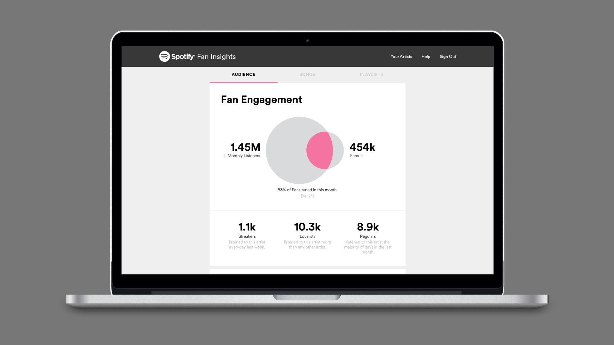

# Insights for Music Artists

## The Problem: New Artists Have Minimal to No Data

Currently, music artists have access to data-backed insights from companies like Spotify, Apple Music, and YouTube (to name a few). The insights provided are derived from listener engagement data (as pictured in the Spotify dashboard above), listener demographic data, streaming data, as well as earned revenue data. 

The problem, however, is that new artists are highly unlikely to have a substantial listenership, meaning that majority of their songs have been streamed under 1,000 times. Therefore, **new artists do not yet have enough data** to fuel the insights provided by these companies, leaving them with minimal insights to inform their marketing efforts.

## The Solution: Artist Insights Web App

I developed a web app and model that returns useful insights for artists at any point in the development of their listenership.

## Example: Andrew Marks - DJ, Producer, Dance Music Artist

## To Use the App, Copy Artist's Spotify URI

## Sample Artist Insights Report

## Why find similar artists and suggested genre tags?

### Facebook Ads Targeting: Lady Gaga

### Facebook Ads Targeting: EDM

## Why stratify similar artists by popularity score?

## Next Steps

